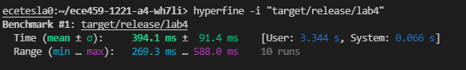
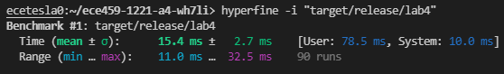
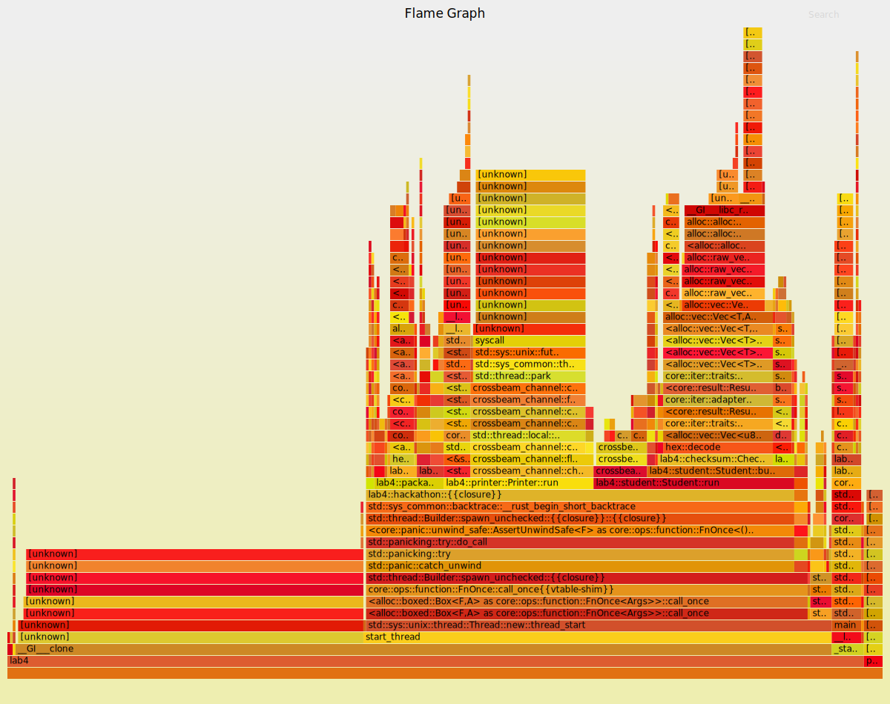
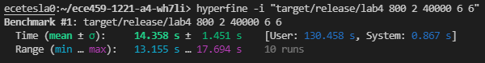
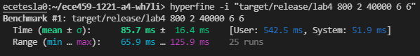
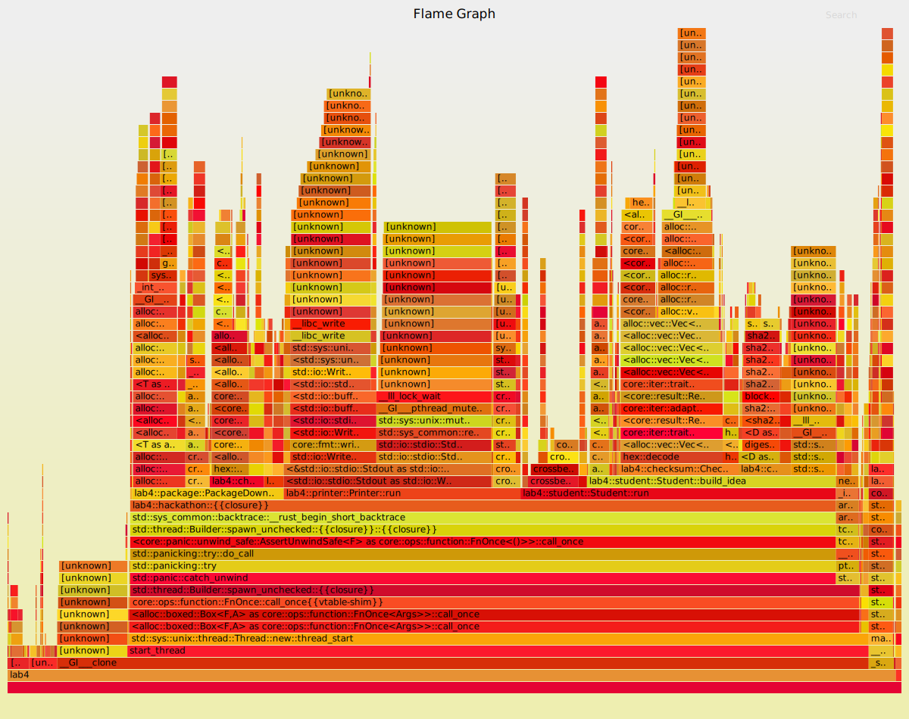
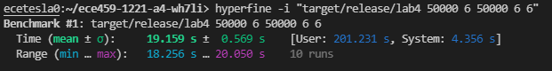
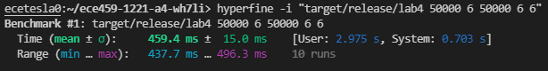
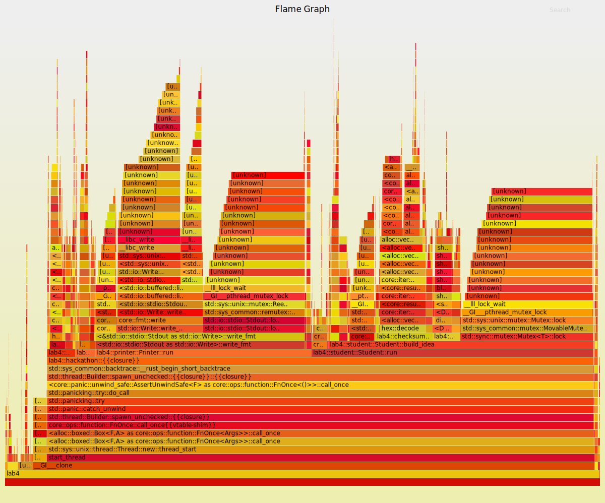

# Lab 4: Profiling and improving the performance of a program

# Summary

In this assignment, we were given a working program that simulates a hackathon, using three different types of threads: Students, Idea Generators, and Package Downloaders. As command line arguments, the number of students, ideas, idea generators, packages, and package downloaders are all configurable. Using flamegraph-based profiling and benchmarking using hyperfine, I was able to incrementally improve the performance of the program through a multitude of changes, eventually resulting in a significant speedup of the program (across multiple different sizes of input arguments). All testing and benchmarking was done on the ecetesla0 server.

# Technical details

There were 5 main changes that were made to improve the performance of the program. All these changes were motivated by observations of the flamegraph. In general, whenever a large portion of the flamegraph was being taken up by one function call, it signified that lots of time was being spent performing that function call and that there was room for improvement in that area.

**File reading in package downloader:** In the original [flamegraph](../benchmarks/starter/flamegraph.svg), a significant amount of time could be seen spent in `PackageDownloader::run()`, specifically reading the packages text file and iterating/indexing through the lines. The reason why so much time was spent doing this was because every single time an individual package was being read and "downloaded", the file was being read and iterated through. This was extremely repetitive and inefficient. To fix this, I simply moved the file reading code into main to be only done once, and then split up the resulting lines vector into equal sections to be passed to each package downloader thread.

**Cross product and file reading in idea generator:** Next, it was noticed that in the flamegraph an abnormally large portion of time was being spent in `IdeaGenerator::run()` when trying to get the next idea name. This was because the products and consumers text files were being read, and more significantly, the cross product was being computed in each call of `get_next_idea_name()`. Similar to the file reading in package downloader, these calls are very repetitive and don't change. Once again, this code can be moved out into main and be called only once. The resulting vector of the cross product is then wrapped in an atomic reference count and then passed to each idea generator thread to be accessed.

**Mutex Aquisition Optimizations:** In the next iteration of the flamegraph,
it was observed that waiting on mutex locks was taking up a significant amount of time. To remedy this, I first decreased the critical section sizes as much as possible by wrapping critical sections in a local scope block with braces, and only including the bare minimum lines needed in the block. Next, another optimization could be done due to the associativity/commutativity properties of the XOR operation. Everytime a checksum is XORed in a for loop (requiring a mutex lock the entire time), I used a temporary checksum instead (initialized to 0) which contained the result of the XORing of the loop (does not need the mutex). Then, I acquired the checksum mutex once to only perform one XOR operation, which is `thread-shared checksum XOR local temp checksum`. This ends up with the same XOR result.

**Event Channel Splitting:** Next, I split out the event channel into 2 separate channels. This was done to try to parallelize the use of the shared channel and reduce the amount of time that threads would have to wait to atomically send messages. It was observed in the flamegraph that there was time being spent by threads waiting to access the channel to send an event. One channel is now used to send package downloaded events, and the other channel is used to send new idea events and also signify that there are no more ideas (this is done using an option, `Some(Idea)` means new idea, and `None` means out of ideas). This change required lots of refactoring, especially in `Student::run()`. Something of note is that `recv_end.try_recv()` is used instead of `recv_end.recv()` in the `Student::run()` loop, since we do not want to block waiting on one channel when there is a message ready to be received in the other channel.

**Printing Optimizations:** Lastly, I made some improvements related to the intermediate printing done by the student whenever a new idea is built. I noticed in the profiling that lots of time was being spent writing to stdout, including the actual printing, and also waiting to access stdout (since its shared between all the student threads). This is time wasted by the student thread which could be instead used to build the next idea. As such, I created new printing threads (one for each student thread) and a shared crossbeam channel between student threads and printing threads. Instead of waiting on the stdout lock and printing out the info about a new idea, a student thread now simply formats the multi-line string to be printed, and sends it to a printing thread (via channel) to do the printing instead. This means that a student thread does not have to wait at all on acquiring the stdout lock or perform the expensive printing operations, and instead can immediately get started on building the next idea. One more technicality is that at the end, once a student thread is about to terminate, it also sends an empty string message to a printing thread to signify the printing thread to terminate (each student thread is therefore responsible for terminating one printing thread).

# Testing for correctness

Testing for correctness in this assignment is relatively straightforward. After each change I made, I ensured that the program was still correct by observing the final checksums outputted. Firstly, the final idea generator checksum should equal to the final student idea checksum, and the final package downloader checksum is equal to the final student package checksum. This ensures that the student threads have created the right number of ideas using the right packages.

Afterwards, the final checksums were compared to the final checksums outputted by the starter code (when run with the same input arguments). As long as the checksums still match, we know that the same ideas are being generated as the intended behaviour, using the same packages. This means that the output of the hackathon simulation has not changed and is therefore correct.

# Testing for performance.

As alluded to earlier, each change that was made in an attempt to improve the performance of the program was done so based on some observation of the flamegraph. After each change, hyperfine was used to benchmark/time the resulting code, validating that the change did in fact speed up the program.

In general, my workflow was as such (each iteration):
- Profile the program using the flamegraph
- Identify an area that can be improved
- Optimize program to improve that area
- Benchmark program to validate improvement (program should be faster now)

Essentially, iteratively benchmarking the changes I made using hyperfine and ensuring that each change made an improvement in runtime was how I tested for performance.

*An important note:* In order to not bias the improvements made to only one set of input sizes, both profiling and benchmarking was done on multiple  sets of input arguments during each improvement iteration. I usually used the following sets of input arguments: 80 2 4000 6 6 (default), 800 2 40000 6 6, and 50000 6 50000 6 6. Certain changes had more of an effect on certain input sizes, however with all three sizes there was a significant increase in performance in the end

**Input - 80 2 4000 6 6:**\
Starter code runtime:\
\
Final code runtime:\
\
Overall, there is a speedup of around 25.6x (using mean time).\
Final flamegraph:\
\
We can see that the flamegraph is dominated by [unknown], crossbeam channel sending (difficult to optimize any more), and checksum updating (difficult to optimize any more).

**Input - 800 2 40000 6 6:**\
Starter code runtime:\
\
Final code runtime:\
\
Overall, there is a speedup of around 167.5x (using mean time).\
Final flamegraph:\
\
The flamegraph does not appear to be dominated by any single call stack.

**Input - 50000 6 50000 6 6:**\
Starter code runtime:\
\
Final code runtime:\
\
Overall, there is a speedup of around 41.7x (using mean time).\
Final flamegraph:\

